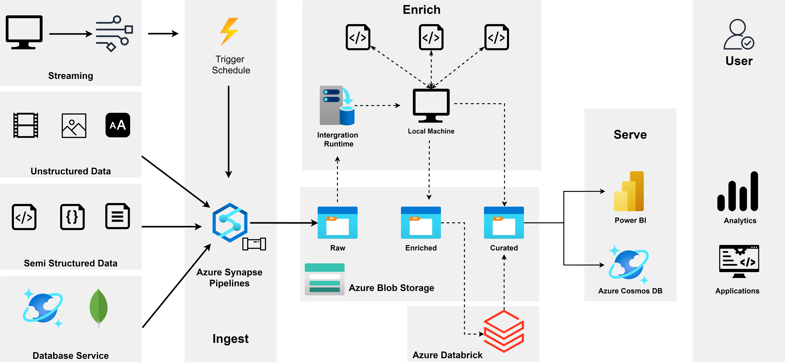

# myrecommender
## Kiến trúc xây dựng

## Raw data
- Dữ liệu raw của tập dữ liệu MovieLens được lưu trong [folder](data). Tập dữ liệu sử dụng để thực nghiệm là `movielens_1M`
- Dữ liệu được crawler, dùng python để download trong thư mực [movie_poster](crawler).

## Enrich data
### Dữ liệu được tiền xử lý theo luồng sau:
- Chuyển dữ liệu về dạng `.csv` và lưu vào folder [enrich](enrich)
- Thêm tên các cột cho data: userID, itemID, rating, timestamp, ...

## Làm giàu dữ liệu
- Tạo dữ liệu giả lập streaming bằng file [createStreamingdata](notebooks/createStreamingdata.ipynb) -> dữ liệu được tạo ra sẽ lưu trong folder raw chờ để đưa lên Azure Blob Storage

## Deep Learning & Recommendation Systems
### KNN
Sử dụng KNN để thực hiện xây dựng hệ khuyến nghị

### Deep Learning
Dùng model LightGCN để xây dựng hệ khuyến nghị

## Visualize

## Deploy ứng dụng

